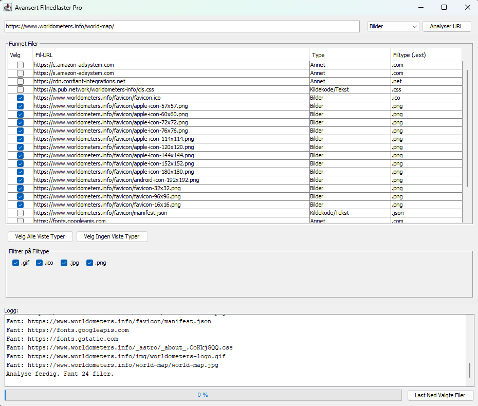
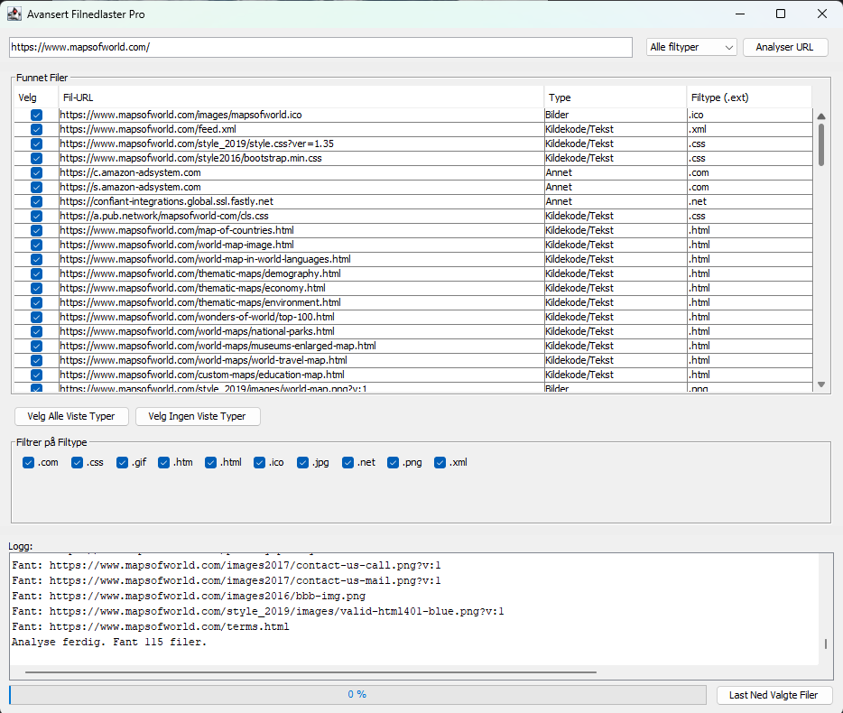

# Avansert Filnedlaster

En Java Swing-basert skrivebordsapplikasjon for å analysere nettsider og laste ned ulike filtyper som bilder, dokumenter, videoer og mer.




## Skjermbilder

| Applikasjonen i bruk                       | Detaljvisning (eller annet bilde)        |
| :----------------------------------------: | :--------------------------------------: |
|  |  |


## Funksjoner

*   **URL Analyse:** Skriv inn en URL for å hente lenker til filer fra nettsiden.
*   **Fleksibel Filtypevalg:**
    *   Velg en generell filkategori (Bilder, Dokumenter, Videoer, etc.).
    *   Filtrer videre på spesifikke filendelser (f.eks. kun `.jpg` og `.png` innenfor "Bilder").
*   **Interaktiv Filliste:**
    *   Se en liste over alle funnede filer med detaljer som URL, type og filendelse.
    *   Velg/fjern individuelle filer for nedlasting.
    *   Sorterbare kolonner.
*   **Batch Nedlasting:** Last ned flere valgte filer samtidig.
*   **Progressvisning:** En progressbar viser fremdriften under analyse og nedlasting.
*   **Loggvindu:** Viser detaljerte meldinger om hva applikasjonen gjør.
*   **Valg av Mappe:** Velg enkelt hvor de nedlastede filene skal lagres.
*   **Robust Filnavn-håndtering:** Forsøker å hente filnavn fra `Content-Disposition`-header og håndterer duplikate filnavn.

## Teknologier Brukt

*   **Java:** Hovedprogrammeringsspråk.
*   **Swing:** For grafisk brukergrensesnitt (GUI).
*   **Jsoup:** For HTML-parsing og uthenting av lenker fra nettsider.

## Komme i Gang

### Forutsetninger

*   Java Development Kit (JDK) 8 eller nyere installert.
*   [Jsoup-biblioteket](https://jsoup.org/download). `jsoup-X.X.X.jar`-filen må være tilgjengelig i prosjektets classpath.

### Kompilering og Kjøring (fra kommandolinjen)

1.  **Klon repositoryet (eller last ned filene):**
    ```bash
    git clone https://github.com/dittbrukernavn/dittprosjektnavn.git
    cd dittprosjektnavn
    ```

2.  **Plasser `jsoup-X.X.X.jar`:**
    Opprett en `lib`-mappe i prosjektets rot og plasser `jsoup-X.X.X.jar` der.

3.  **Kompiler kildekoden:**
    Anta at kildekodene (.java-filene) ligger i `src/` med riktig pakkestruktur (f.eks. `main`, `main/model`, `main/ui`, `main/util`). Pakkenavnet for hovedklassen er `main`.
    ```bash
    # Fra prosjektets rotmappe
    javac -cp "lib/jsoup-X.X.X.jar" -d out src/main/util/UrlUtil.java src/main/model/FileCategory.java src/main/model/FileInfo.java src/main/ui/FilesTableModel.java src/main/DownloaderApp.java
    ```
    *(På Windows, bruk `;` som classpath-separator hvis du har flere elementer: `javac -cp "lib/jsoup-X.X.X.jar;." ...`)*
    *(På Linux/macOS, bruk `:` som classpath-separator: `javac -cp "lib/jsoup-X.X.X.jar:." ...`)*

4.  **Kjør applikasjonen:**
    ```bash
    # Fra prosjektets rotmappe
    java -cp "out;lib/jsoup-X.X.X.jar" main.DownloaderApp
    ```
    *(På Linux/macOS, bruk `:` som classpath-separator: `java -cp "out:lib/jsoup-X.X.X.jar" main.DownloaderApp`)*

### Bruke et IDE (f.eks. IntelliJ IDEA, Eclipse)

1.  Klon repositoryet.
2.  Åpne prosjektet i ditt IDE.
3.  Legg til `jsoup-X.X.X.jar` som et bibliotek/avhengighet i prosjektinnstillingene.
4.  Finn `DownloaderApp.java` (i `main`-pakken) og kjør `main`-metoden.

## Brukerveiledning

1.  Start applikasjonen.
2.  Skriv inn URL-en til nettsiden du vil analysere i URL-feltet.
3.  Velg ønsket filkategori fra nedtrekksmenyen (f.eks. "Bilder", "Dokumenter").
4.  Klikk på "Analyser URL". Applikasjonen vil hente potensielle filer og vise dem i tabellen.
5.  Tabellen vil automatisk forhåndsvelge filer som matcher den valgte kategorien.
6.  Bruk sjekkboksene i "Filtrer på Filtype"-seksjonen for å finjustere valget av filendelser.
7.  Du kan også manuelt velge/fjerne individuelle filer i tabellen.
8.  Bruk "Velg Alle Viste Typer" / "Velg Ingen Viste Typer" for raskt valg.
9.  Når du er fornøyd med valget, klikk "Last Ned Valgte Filer".
10. Velg en mappe hvor filene skal lagres.
11. Følg med på progressbaren og loggvinduet for status.

## Fremtidige Forbedringer (Mulige Idéer)

*   [ ] Forhåndsvisning av bilder direkte i applikasjonen.
*   [ ] Hente metadata (f.eks. filstørrelse, `Content-Type`) før nedlasting.
*   [ ] Mulighet for å avbryte pågående analyse eller nedlasting.
*   [ ] Flertrådet nedlasting for raskere ytelse.
*   [ ] Støtte for innlogging på sider som krever autentisering (komplekst!).
*   [ ] Mer avansert filtrering og søk i fillisten.
*   [ ] Lagre og laste brukerinnstillinger (f.eks. sist brukte mappe).
*   [ ] Bedre feilhåndtering og mer informative feilmeldinger.

## Bidrag

Bidrag er velkomne! Hvis du har forslag til forbedringer eller feilrettinger, vennligst opprett en "Issue" eller send en "Pull Request".

## Lisens

Dette prosjektet er lisensiert under [MIT-lisensen](LICENSE.md) - se `LICENSE.md`-filen for detaljer.
<!-- Eller fjern/endre hvis du ikke bruker MIT-lisens -->

---

Bygget med ❤️ og Java.